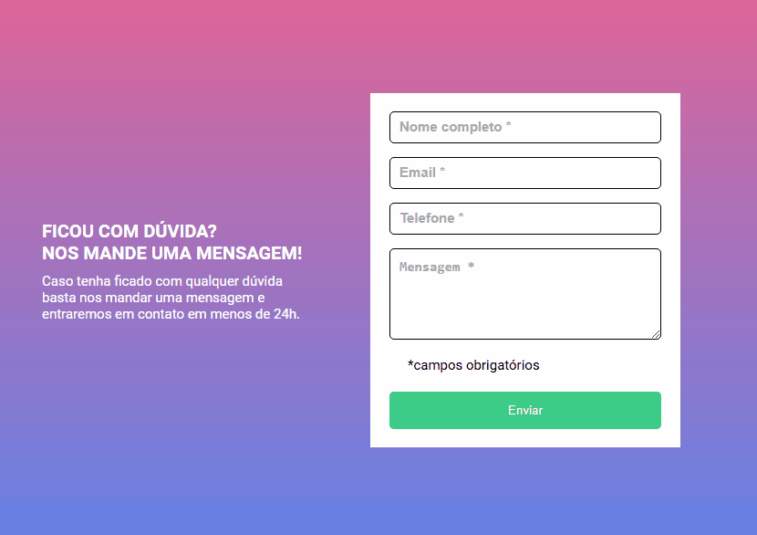

# Formulário de Validação

Este projeto consiste em um formulário com validação de entrada 
para garantir que os dados fornecidos pelos usuários estejam no 
formato correto e sigam as regras estabelecidas.

# Recursos

- Validação em tempo real enquanto o usuário preenche os campos.
- Mensagens de erro amigáveis para guiar o usuário.
- Suporte para validação de campos como:
- Nome
- E-mail
- Número de telefone
- Campo de mensagem livre
- Design responsivo para dispositivos móveis e desktop.

# tecnologias utilizadas

- HTML: Estrutura básica do formulário.
- CSS: Estilização do formulário
- JS: Lógica de validação e interação com o usuário

# Gif apresentando projeto

